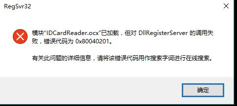
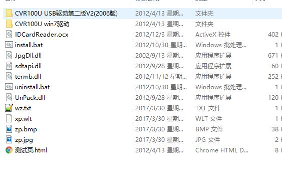
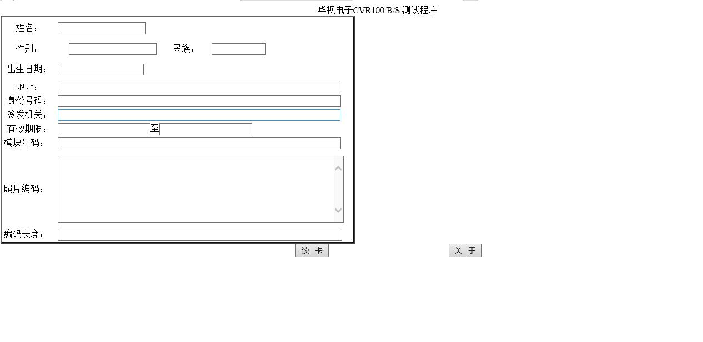
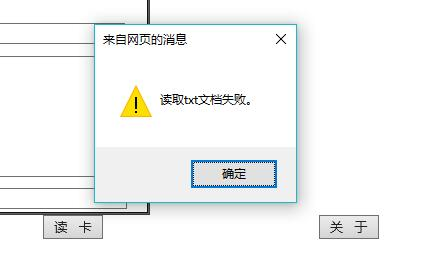
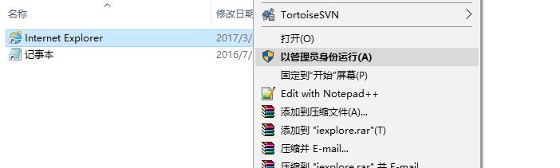
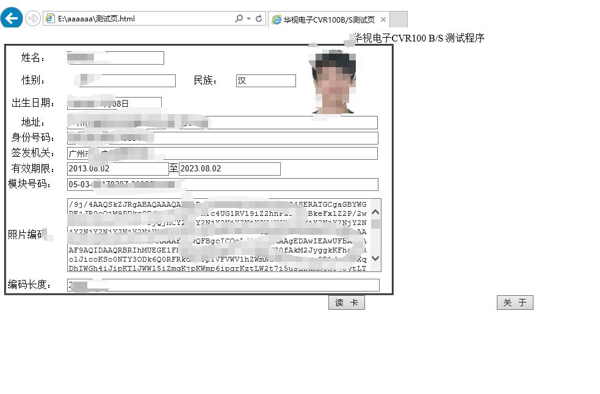

# 华视 CVR-100U 身份证书卡机html的二次开发
> 华视打卡器，html界面二次开发。  
> 主要注意事项  
> 1.下载正确的驱动包以及开发sdk  
> 2.安装文件路径权限  
> 3.浏览器运行权限必须以管理员身份运行

## 详细教程

</img>

### 第一步 下载开发所需的文件
 [进入华视官网下载页](http://www.chinaidcard.com/category/download/)  	
这里是做html开发所以下载对应一下的文件
- 驱动包
	</img>
- 运行包
	</img>

> 下载解压后文件夹

- 驱动包根据自己电脑配置和需求安装对应的版本 

	</img>

- 安装运行包
	</img>	
> 在上一个步骤安装CVRDLL.exe 中可能会出现 所以都必须使用以管理员的身份运行   
 
</img>

</img>

### 第二步运行demo
> 特别注意运行IDCArdREader.ocx 文件必须得用浏览器的ActiveX控件使用  
> 目前支持ActiveX控件的小编了解的只有ie，尝试了用chrome安装IE Tab Multi 使用  
> 但是结果是这样无法使用↓

</img>

- 用ie浏览器打开demo后
	
</img>

> 天杀的最必须注意的一点，在这里耗了很长时间，费了很多脑细胞，打电话给客服和技术没有解决的问题就是

</img>

- 我和小伙伴翻了很多网站，咨询了客服一边又一遍。后来我们找到了win7的一台电脑尝试成功了  
- 但是换到了另外一台win7电脑上尝试又出现了这个问题。这到底系统问题还是什么问题呢。
- 后来发现了一个特点，能成功运行windows上面都没有出现这个情况
- </img>
- 这个是需要管理员权限。可以说是导致读取txt失败的原因就是权限了
- 所以打开ie浏览器的时候必须以管理员的权限打开
- </img>


二次开发就可以调用他demo里面的代码，其实相当简单
主要代码
```

<body style="text-align: center">
 <form id="form1" runat="server">    
    <OBJECT classid="clsid:10946843-7507-44FE-ACE8-2B3483D179B7"
	  id="CVR_IDCard" name="CVR_IDCard" width="0" height="0" >
</OBJECT>

			<script language="javascript" type ="text/javascript">
					
function ClearForm() {
                       document.all['Name'].value = ""; 
                       document.all['Sex'].value = ""; 
                       document.all['Nation'].value = ""; 
                       document.all['Born'].value = ""; 
                       document.all['Address'].value = ""; 
                       document.all['CardNo'].value = ""; 
                       document.all['IssuedAt'].value = ""; 
                       document.all['EffectedDate'].value = ""; 
                       document.all['ExpiredDate'].value = ""; 
                       document.all['SAMID'].value = ""; 
                       document.all['pic'].src = ""; 
                       document.all['Picture'].value = "";  
                       document.all['PictureLen'].value = "";     
                       return true;
}
function Button1_onclick() {
                    var CVR_IDCard = document.getElementById("CVR_IDCard");					
					var strReadResult = CVR_IDCard.ReadCard();
					if(strReadResult == "0")
					{
ClearForm();
					      					document.all['Name'].value = CVR_IDCard.Name;  
                          document.all['Sex'].value = CVR_IDCard.Sex;    
                          document.all['Nation'].value = CVR_IDCard.Nation; 
                          document.all['Born'].value = CVR_IDCard.Born;     
                          document.all['Address'].value = CVR_IDCard.Address; 
                          document.all['CardNo'].value = CVR_IDCard.CardNo; 
                          document.all['IssuedAt'].value = CVR_IDCard.IssuedAt;  
                          document.all['EffectedDate'].value = CVR_IDCard.EffectedDate;  
                          document.all['ExpiredDate'].value = CVR_IDCard.ExpiredDate;
                          document.all['SAMID'].value = CVR_IDCard.SAMID;
                          document.all['pic'].src = CVR_IDCard.Pic;
                          document.all['Picture'].value = CVR_IDCard.Picture;  
                          document.all['PictureLen'].value = CVR_IDCard.PictureLen  
                      }
                      else
                      {
                        ClearForm();
                        alert(strReadResult);
                      }
					
}
```


运行结果

</img>

